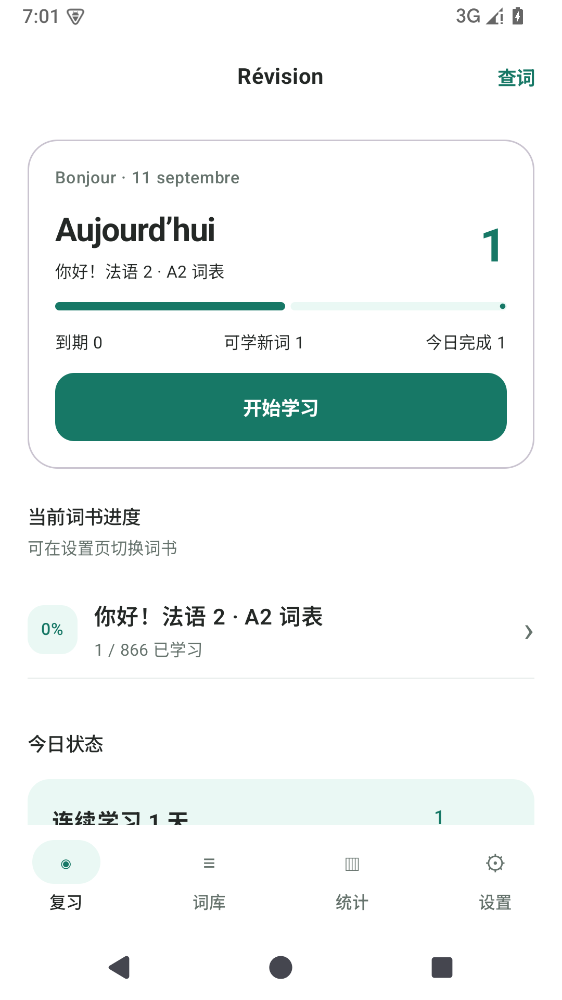
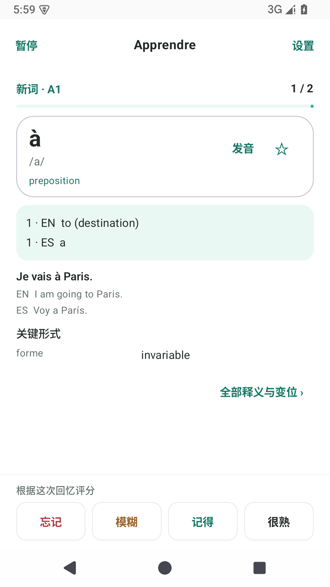
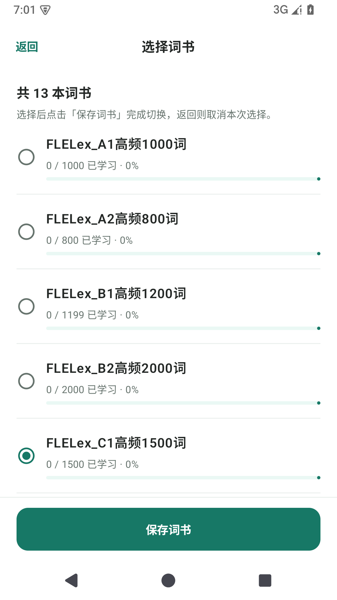
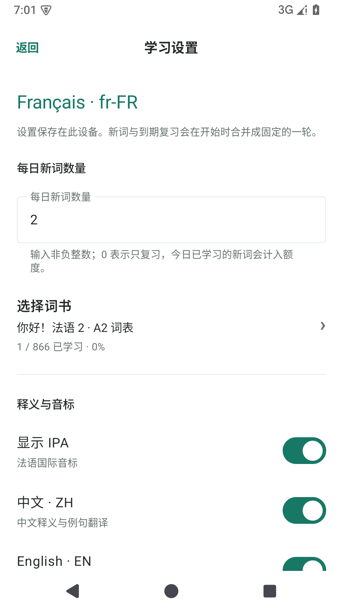

# French Vocab · 法语离线背词

<p align="center">
  面向中文学习者的原生 Android 法语词汇应用<br>
  离线词库 · FSRS 间隔复习 · 中英西释义 · 多词书切换与进度
</p>

<p align="center">
  <strong>当前版本：0.5.0</strong> · 最低 Android 8.0 · 无需账户 · 无需网络
</p>

## 界面预览

<p align="center">
  
  
  
  
</p>

<p align="center">
  首页与进度 · 回忆与评分 · 词书选择 · 学习设置
</p>

## 项目简介

French Vocab 是一款使用 Kotlin 与 Jetpack Compose 开发的离线 Android 法语背词应用。界面语言为中文，学习语言固定为法国法语（fr-FR），词库可同时提供中文、英语和西班牙语释义及例句译文。

应用围绕“先回忆、再揭示、后评分”的学习流程设计。复习计划由 FSRS-6 调度，卡片、学习日志、队列、设置、收藏和进度均保存在设备本地。应用本身不需要注册账户，清单中也未申请互联网权限。

## 核心功能

- **科学复习**：使用 FSRS-6 长期调度，根据每次评分计算下一次复习时间。
- **多词书学习**：可浏览和切换 13 本词书；每本词书展示对应进度，同一词条跨词书共享学习记录。
- **多语言释义**：中文、英语和西班牙语可分别开关，至少保留一种显示语言。
- **完整学习流程**：正面回忆、点击卡片外空白揭示、四档评分、单轮总结。
- **每日学习计划**：每日新词数量可自由设置；设为 0 时只复习到期词。
- **本地持久化**：退出应用或系统结束进程后，未完成队列和已揭示状态仍可恢复。
- **词库浏览**：支持法语、中文、英语和西班牙语搜索，并忽略法语重音差异。
- **收藏与统计**：可收藏词条，查看当前词书进度和最近一轮学习结果。
- **离线发音**：优先使用本地录音；无录音时可调用设备已安装的离线法国法语 TTS。

## 当前词库

当前内置数据库包含：

- 19,465 个唯一词条
- 19,525 条义项与配套例句
- 3,015 个动词
- 54,270 条动词变位
- 13 本可选词书

动词表覆盖直陈式现在时、复合过去时和未完成过去时，每个时态包含六个人称。高频词书是对应完整 FLELex 词书的子集，因此各词书的词条数不能直接相加作为唯一词条总数。

| 词书类型 | 覆盖范围 |
| --- | --- |
| 教材词书 | 《你好！法语 2》A2 词表，866 个词条 |
| 专项词书 | A2 动词，242 个词条 |
| FLELex 完整词书 | A1、A2、B1、B2、C1、C2 |
| FLELex 高频词书 | A1 高频 1000、A2 高频 800、B1 高频 1199、B2 高频 2000、C1 高频 1500 |

词性、IPA、词形、释义和例句来自教材整理、开放词典快照与离线生成流程。内容已经通过结构、覆盖和数据库完整性校验，但机器辅助生成部分仍有待专业人工逐条审校。

## 下载与安装

> **下载地址：** [Memento Fr 0.5.0 Release](https://github.com/Scooooooott/Memento_Fr/releases/tag/v0.5.0) · [直接下载 APK](https://github.com/Scooooooott/Memento_Fr/releases/download/v0.5.0/Memento-Fr-0.5.0-debug.apk)
>
> 本次提供使用现有开发签名构建的 Debug APK，校验值随 Release 提供。

当前版本为 0.5.0，最低支持 Android 8.0（API 26）。下载 APK 后，允许对应文件管理器安装未知来源应用，再按系统提示完成安装。

同一签名的新版 APK 可以直接覆盖安装并保留已有学习数据。签名不同的安装包无法直接覆盖；卸载应用会清除设备上的本地学习记录。

## 使用方法

1. 打开设置，选择需要学习的词书。
2. 设置每日新词数、释义语言和自动发音方式。
3. 保存设置后回到首页，开始新的学习轮次。
4. 看到词条后先自行回忆，再点击词卡外的空白区域揭示答案。
5. 根据实际回忆情况选择“忘记”“模糊”“记得”或“很熟”。
6. 完成本轮后查看总结；到期卡片会在之后的学习轮次中再次出现。

学习轮次开始后，其词书和显示设置会被冻结到本轮结束。中途返回首页只会暂停学习，再次进入时将继续原队列。已经学习过的到期词不会因为切换当前词书而丢失。

## 调度策略

调度器移植自 Open Spaced Repetition 的 **ts-fsrs 5.4.2**，采用 FSRS-6 LongTermScheduler：

- 目标记忆率为 90%
- 关闭随机间隔
- 关闭分钟级学习与重学步骤
- 新卡四档初始间隔分别为 1、2、3、8 天
- “忘记”不会重新插入当前轮，最早在 24 小时后到期

Kotlin 移植保留上游的默认参数、八位小数舍入、UTC 日历日计算和间隔边界行为，并使用上游生成的固定样例进行数值一致性测试。算法来源和实现策略见 [FSRS 移植说明](app/src/main/java/com/scott/frenchvocab/domain/fsrs/README.md)。

## 数据与隐私

- 应用不要求账户，也未申请 Android 互联网权限。
- 用户设置、收藏、复习状态和日志保存在本地 SQLite 数据库中。
- 内容数据库与用户数据库相互独立，升级词库不会主动清空学习历史。
- Android 系统是否备份应用数据取决于设备和系统账户的备份设置。
- 应用不附带真人录音；TTS 是否可用取决于设备是否安装离线 fr-FR 语音。

## 技术栈

| 类别 | 技术 |
| --- | --- |
| 应用语言 | Kotlin 2.0.21 |
| 界面 | Jetpack Compose、Material 3 |
| 本地存储 | Android SQLite |
| 复习算法 | FSRS-6 LongTermScheduler |
| 构建系统 | Gradle 8.9、Android Gradle Plugin 8.7.3 |
| Android 版本 | minSdk 26、targetSdk 35、compileSdk 35 |
| Java 字节码 | Java 17 |
| 内容工具 | Python 3.10+、SQLite |

## 本地构建

准备以下环境：

- JDK 17 或更高版本
- Android SDK 35
- 可用的 `local.properties`，其中配置本机 Android SDK 路径

Windows：

```powershell
.\gradlew.bat assembleDebug testDebugUnitTest lintDebug
```

macOS 或 Linux：

```bash
./gradlew assembleDebug testDebugUnitTest lintDebug
```

Debug APK 生成在 `app/build/outputs/apk/debug/`。项目维护环境也提供 `tools/build.ps1`，用于在项目内隔离 Gradle、Android 和临时目录；使用前需按本机环境配置 `tools/project-env.ps1`。

词库生成与校验工具位于 `tools/lexicon/`。正式内容源、固定快照和来源信息分别保存在 `data/curated/` 与 `data/raw/`。

## 项目结构

| 位置 | 说明 |
| --- | --- |
| `app/src/main/java/` | Android 应用源码 |
| `app/src/main/assets/` | 正式内容数据库与第三方内容声明 |
| `app/src/test/` | JVM 单元测试与 FSRS 数值样例 |
| `app/src/androidTest/` | 数据库、界面、音频和升级验收测试 |
| `data/curated/` | 整理后的正式词库源与出处信息 |
| `data/raw/` | 离线构建使用的固定原始快照 |
| `tools/lexicon/` | 词库抓取、整理、生成和校验脚本 |
| `docs/` | 开发记录、内容契约和验收材料 |
| `docs/qa/` | 验收报告与界面截图 |

主要 Kotlin 代码位于 `app/src/main/java/com/scott/frenchvocab/`：

- `data/content/`：只读内容数据库
- `data/user/`：学习记录、队列、事务、设置和统计
- `domain/fsrs/`：FSRS 调度器
- `domain/audio/`：本地录音与 TTS 播放
- `feature/`：Compose 页面、导航和界面状态

## 内容来源与审校边界

词库使用或参考了 Wiktionary、Kaikki.org、WiktApi、Apertium、CFDICT、FLELex 与 eSpeak NG 等资源。各条目的来源信息保存在内容数据库和 `data/curated/provenance*.json` 中，第三方内容说明见 [THIRD_PARTY_CONTENT.md](app/src/main/assets/THIRD_PARTY_CONTENT.md)。

需要注意：

- 开放词典提供的是词性、IPA、词形、简短释义和例句等词典事实。
- 部分缺失释义、译文与例句由机器辅助流程补全。
- 自动校验只能确认结构、覆盖、引用和数据库约束，不能替代专业语言审校。
- 当前未收录真人录音，也不覆盖所有多义义项、时态、语气和地区发音变体。

## 相关文档

- [中文内容契约](docs/CONTENT_CONTRACT_ZH.md)
- [A1 教材内容覆盖报告](docs/qa/A1_CONTENT_COVERAGE.md)
- [40 词种子内容审校报告](docs/qa/CONTENT_REVIEW.md)
- [词书选择功能验收](docs/qa/book-picker/ACCEPTANCE.md)
- [0.3.0 开发记录](docs/CHANGELOG_0.3.0.md)
- [早期开发目标与分工](docs/DEVELOPMENT_PLAN.md)

## 当前限制

- 仅提供 Android 客户端和中文操作界面。
- 当前提供 Debug APK；尚未提供使用生产签名的 Release 构建。
- 当前内容包含机器辅助生成部分，尚未完成专业人工逐条审校。
- 发音依赖设备本地 TTS，未安装法语语音包时仍可学习，但无法自动朗读。

## 许可证

<!-- 待补充 -->
